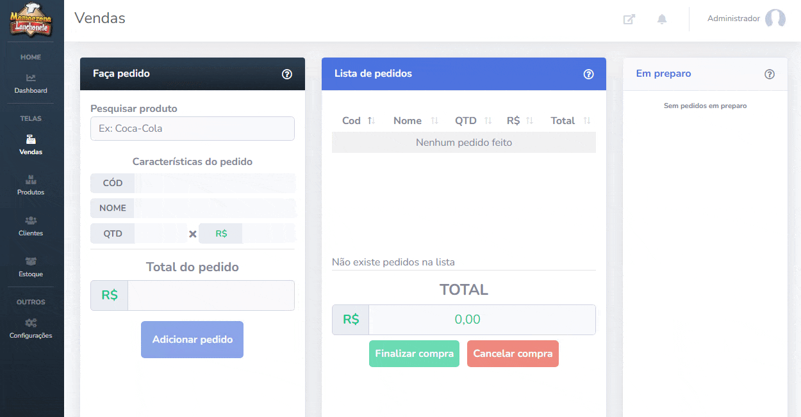
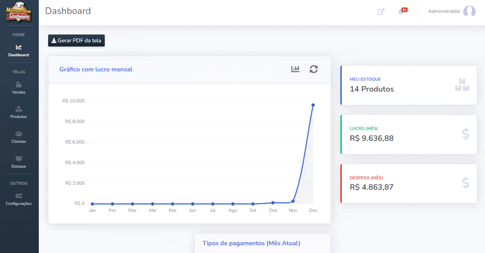
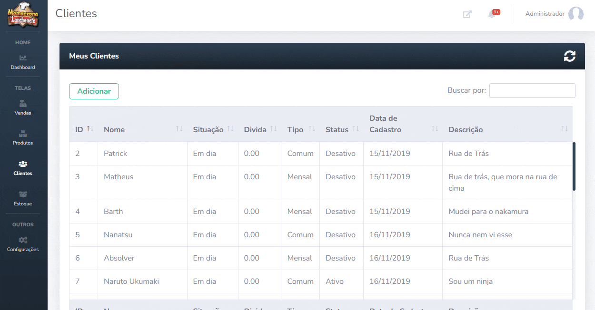
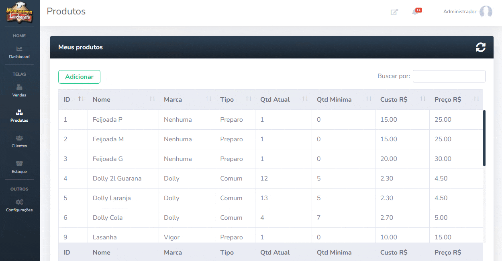
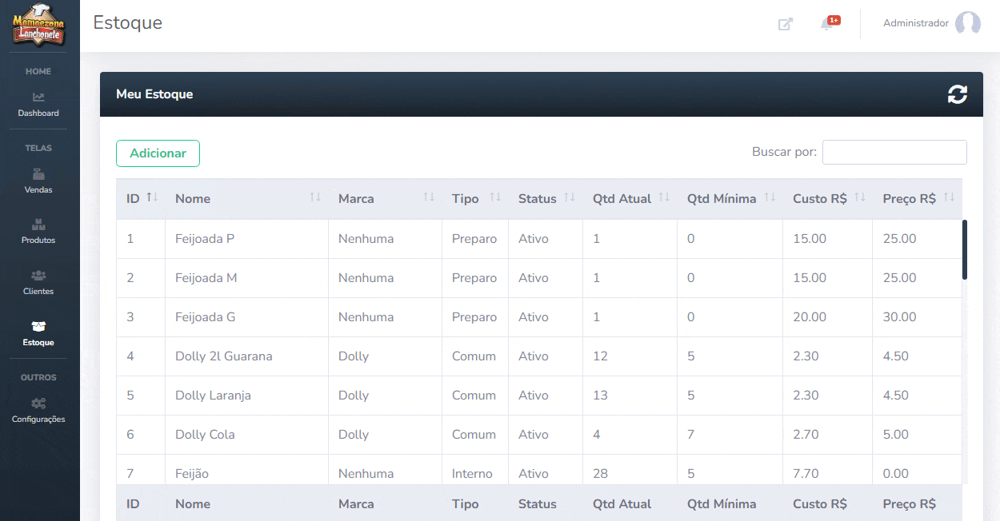

<h1 align="center">TCC ETEC</h1>

Esse projeto foi desenvolvido pelo meu grupo em 2019, como trabalho de conclusão de curso (TCC) em nossa formação como Técnicos em Desenvolvimento de Sistemas pela instituição ETEC.

## O que é?

Como regra da instituição, o TCC deve ser um projeto que ataque e resolva uma necessidade de uma pessoa ou empresa. Sendo assim, é necessário encontrar um cliente real, sendo remunerados ou não pelo projeto, para concluir o trabalho.

Encontramos uma lanchonete regional chamada **Mamãezona** que necessitava encontrar uma solução para gerir o seu negócio de forma virtual, então a empresa aceitou participar de nosso projeto.

Fizemos uma entrevista com o intuito de analisar e entender melhor o funcionamento da empresa e para o levantamento de requisitos.

Identificamos que era necessário um sistema que:

- Possua uma forma de registrar, consultar e vender seus produtos (Ponto de Venda);
- Mostre métricas sobre suas vendas;
- Seja capaz de armazenar, consultar e gerir seus clientes, produtos e estoque;
- Fosse capaz de comunicar pedidos do balcão para a cozinha de forma rápida e simples.

Depois de discussões sobre como resolveriamos essas necessidades, fizemos os prímeiros protótipos. Confira as imagens:

- [O primeiro protótipo desenhado](./prototipo/v1/)
- [O segundo protótipo desenhado](./prototipo/v2/)

Quando decidido por onde seguiriamos, iniciamos o desenvolvimento do projeto. Você também pode conferir o resultado na demonstração a seguir.

## Demonstração

Funcionalidades globais:
- Sistema de notificação para ações bem sucedidas e má sucedidas;
- Receba notificações informando quando um produto no estoque atingir o mínimo de unidades, ficar abaixo do mínimo ou não houver mais produto.

  <strong>Painel do ponto de venda, comanda e comunicação com a cozinha</strong>  
  

Funcionalidades do campo **Faça pedido**:
- Busca dinámica de produtos e duplo clique para evitar seleções erradas;
- Visualize infomações do produto;
- Defina a quantidade de um produto e o valor do pedido será atualizado dinamicamente.

Funcionalidades do campo **Lista de pedidos**:
- Lista todos os pedidos realizados no campo anterior;
- Selecione pedidos adicionados por erro ou desistência e os exclua;
- Obtenha o valor total de todos os pedidos somados;
- Cancele ou finalize a compra escolhendo a opção de pagamento e defina se é um pagamento direto ou mensal (sendo possível buscar o cliente por tipo);
- Dedução automática de produtos no estoque ao finalizar a venda.

Funcionalidades do campo **Em preparo e Cozinha**:
- Pedidos que necessitam de preparo (como feijoada) são adicionados automaticamente na fila de preparo;
- A fila de preparo é sincronizada com o painel da cozinha;
- A cozinha informa quando um produto está pronto;
- O campo em preparo obtém o status atualizado de um pedido a cada 15 segundos.

  <strong>Painel da dashboard para obter métricas</strong>  
  

Funcionalidades:
- Obtenha informações sobre o estoque, despesa e lucro;
- Visualize o histórico de lucro mensalmente em gráficos;
- Visualize quais as formas de pagamento mais usadas.

  <strong>Painel para gerir clientes</strong>  
  

Funcionalidades:
- Adicione, altere ou desative clientes;
- Visualize todas as informações dos clientes na tabela com filtros de pesquisa;
- Desative mais de um cliente com a seleção múltipla.

  <strong>Painel para gerir os produtos</strong>  
  

Funcionalidades:
- Adicione, altere ou exclua produtos;
- Visualize todas as informações dos produtos na tabela com filtros de pesquisa;
- Exclua mais de um produto com a seleção múltipla.

  <strong>Painel para o controle de estoque</strong>  
  

Funcionalidades:
- Adicione, altere ou exclua produtos em seu estoque;
- Visualize todas as informações do estoque na tabela com filtros de pesquisa;
- Exclua mais de um produto do estoque com a seleção múltipla.

## Quais tecnologias foram usadas?

- [HTML](https://developer.mozilla.org/pt-BR/docs/Web/HTML), [CSS](https://developer.mozilla.org/pt-BR/docs/Web/CSS) e [JavaScript](https://developer.mozilla.org/pt-BR/docs/Web/JavaScript)
- [JQuery](https://jquery.com/), [DataTables](https://datatables.net/) e [Chart.js](https://www.chartjs.org/)
- [Bootstrap](https://getbootstrap.com/), [Bootstrap Notify](https://github.com/mouse0270/bootstrap-notify) e [SB Admin 2](https://github.com/StartBootstrap/startbootstrap-sb-admin-2)
- [PHP 7.x](https://www.php.net/) e [MySQL](https://www.mysql.com/)

## Como executar o projeto?

Caso queira apenas testar, considere usar o [Laragon](https://laragon.org/) como gerenciador do ambiente. Ele por padrão executará um servidor apache e um servidor mysql.

Com o Laragon instalado, inicie e clique no botão `root` no canto direito da tela. O seu explorador de arquivos será aberto dentro do diretório `www`, agora arraste o diretório `sistema` desse repositório para dentro do `www`.

Volte ao Laragon e inicie o servidor Apache e o MySQL clicando no botão `iniciar tudo` ou `start all`.

Depois, crie um banco de dados MySQL no botão correspondente com as configurações padrão e nomeie como `mamaezona`. Abra um cliente SQL, como HeidiSQL ou DBeaver, ambas integradas ao Laragon e importe o arquivo `.sql` de [`sistema/php/database.sql`](./sistema/php/database.sql). Execute esse arquivo para criação de toda a estrutura do banco de dados e alguns dados de teste.

Com o banco de dados criado, acesse: [`http://localhost/sistema`](http://localhost/sistema)

## Nosso grupo

- [Matheus Felipe](https://github.com/matheusfelipeog)
- [Patrick Dantas](https://github.com/Akatsushiro)
- [Lucas Santos](https://github.com/lucassep)
- Gustavo Pereira
- Jones Silva

## Avisos

1. Esse projeto não está 100% completo, portanto não use-o em produção sem ter feito uma boa revisão.

2. Todos os dados disponíveis aqui são para fins de testes e não refletem informações reais ou válidas propositalmente.

## Licença

Esse projeto utiliza a licença MIT em todo seu código, confira suas condições em [MIT License](./LICENSE).
