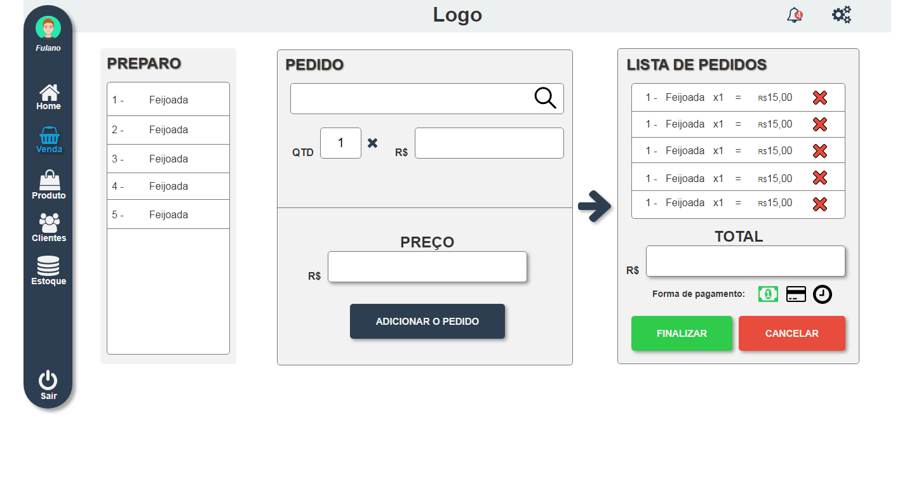
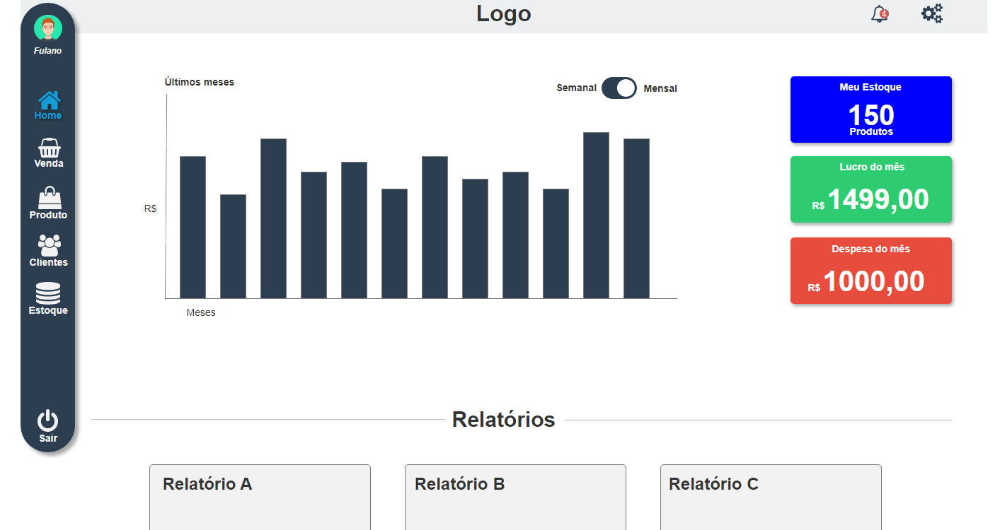
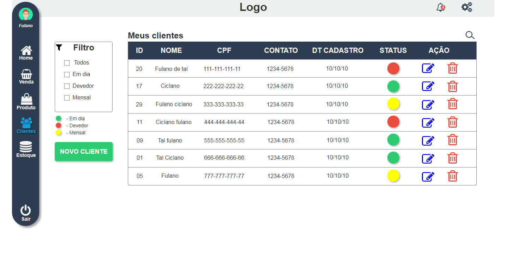
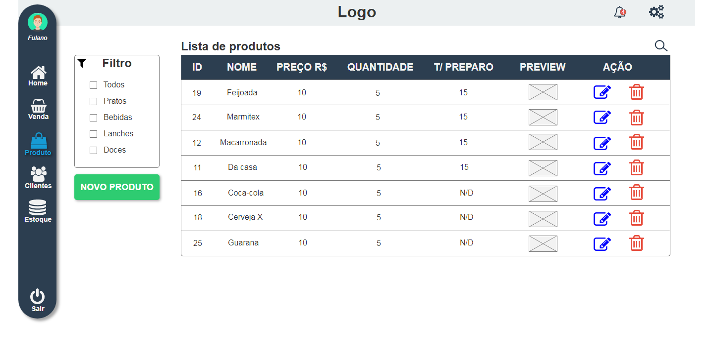
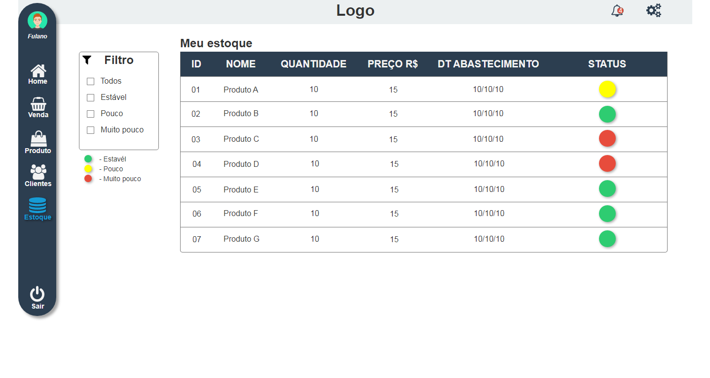

<h1 align="center">Protótipo v2</h1>

  <strong>Painel do ponto de venda, comanda e comunicação com a cozinha</strong>  
  

  <strong>Painel da dashboard para obter métricas</strong>  
  

  <strong>Painel para gerir clientes</strong>  
  

  <strong>Painel para gerir os produtos</strong>  
  

  <strong>Painel para o controle de estoque</strong>  
  

